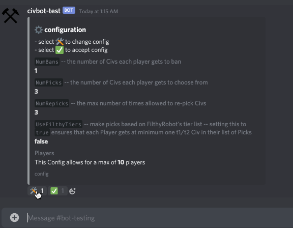

# civ-bot-go

## Description

This a multipurpose Discord bot for various operations related to [Sid Meier's Civilization V][2] written in [Go][3].

At its core the bot handles randomly assigning a group of players lists of civilizations to choose from for a multiplayer game; based on a number of possible configuration options.

## Usage

_Detailed instructions on all available commands are available by running the `/civ help` command. Here's a summary of how to use the bot._

### Configuration

Players can enter the configuration flow by entering the `/civ config` command in the channel where the bot is located. Configuration options are set by interacting with the reactions after each configuration option is presented.

### Starting a new session

Players can start a new session by entering the `/civ new` command. Players join the game by reacting with the ✋reaction. When all players are ready someone just needs to react with the ✅reaction.

### Banning

Depending on the current configuration each player gets to "ban" some number of civs, removing them from the pool of civs that the bot randomly chooses from. Users can enter bans with the `/civ ban <arg>` providing either the civilization name, or leader name. The bot does a fuzzy match on the input and finds the closest matching civilization.

### Picks

After all players have selected their bans the bot chooses a random set of civs for each player to choose from.

### Re-Picks

If the session is configured to allow for re-picks, and at least half the players react with ♻️then, then the bot will randomly choose again.

### Conclusion

Once the allotted number of repicks is reached, or the timer runs out then you're ready to pick a civ from your list and start playing!

## Running Locally

### Bot Setup

- make a discord application in the [discord developer portal][1]
- create a bot for you application and set permissions
  
- add the bot to your discord server
  - go to the "OAuth2" tab, select scope "bot", navigate to the URL that gets generated
- copy the bot token from the "Bot" tab and set the `CIV_BOT_TOKEN` environment variable

### Application Setup

- make sure you have `go` installed by running `go version`, you should see some output like `/usr/local/bin/go`
- clone the repository
- `cd` into the root directory
- install dependencies with `go get github.com/ecshreve/civ-bot-go`
- run the application with `make run`
- now you can go to whatever channel you added the bot to in the previous section and interact with the bot, enter `/civ help` in the channel to see information about how to use the bot

## References

Here's some links that I used as reference throughout the project:

repositories:

- [discordgo](https://github.com/bwmarrin/discordgo)
- [discord-checkers](https://github.com/jmsheff/discord-checkers)
- [closestmatch](https://github.com/schollz/closestmatch)

helpful golang links

- [using go modules](https://blog.golang.org/using-go-modules)
- [golang slice tricks](https://github.com/golang/go/wiki/SliceTricks)

helpful tooling links

- [hosting a discord bot on heroku](https://medium.com/@mason.spr/hosting-a-discord-js-bot-for-free-using-heroku-564c3da2d23f)
- [automate deploys to heroku from github](https://devcenter.heroku.com/articles/github-integration)
- [basic makefiles](https://tutorialedge.net/golang/makefiles-for-go-developers/)

[1]: https://discord.com/developers/applications
[2]: https://store.steampowered.com/app/8930/Sid_Meiers_Civilization_V/
[3]: https://golang.org/
